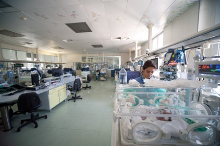

1 Delivery And Neonatal Intensive Care Unit (NICU)
===================================

1.1 Struttura della sala
--------------------------

La sala di **Terapia Intensiva Neonatale** in questione è quella della Clinica Mangiagalli di Milano. 
La sala ospita 10 postazioni di degenza ed è dotata di mezzi diagnostici e terapeutici più all'avanguardia che permettono un'assistenza adeguata per ogni neonato, ad esempio attrezzature per la ventilazione.

Nella sala, lo stato dei neonati ricoverati viene costantemente controllato dall'Unità Operativa, grazie ad una sofisticata cartella clinica informatizzata e a dei moderni sistemi di monitoraggio. 

1.2 Attività
--------

All'interno di questa area di Terapia Intensiva vi sono ricoverati i neonati patologici che vengono assegnati a del personale specializzato, medico ed infermieristico che hanno la responsabilità della gestione di tutte le attività assistenziali e di cura, utilizzando le più moderne e sofisticate tecnologie disponibili. Inoltre, in questa sala vi si attuano interventi abilitativi e fisiatrici su neonati che hanno problemi a livello neurologico e muscolo-scheletrico.

2 Intensive Care Unit
====================

2.1 Struttura della sala
------------------------

2.2 Attività
------------

Bibliografia
------------

**1.** Clinica Mangiagalli: Terapia Intensiva Neonatale, *Terapia Intensiva*, 
[http://www.mangiagalli.it/index.php/unita-operativa-tin/struttura-organizzativa/terzo-liv-terapia-intensiva][1]

**2.** Clinica Mangiagalli: Guida al reparto di Terapia Intensiva Neonatale, *Guida per i genitori dei neonati ricoverati in Terapia Intensiva Neonatale*, 
[http://www.policlinico.mi.it/NeonatiBambiniAdolescenti/GuidaNeonatiRicoveratiInTIN.pdf][2]

[1]: http://www.mangiagalli.it/index.php/unita-operativa-tin/struttura-organizzativa/terzo-liv-terapia-intensiva
[2]: http://www.policlinico.mi.it/NeonatiBambiniAdolescenti/GuidaNeonatiRicoveratiInTIN.pdf